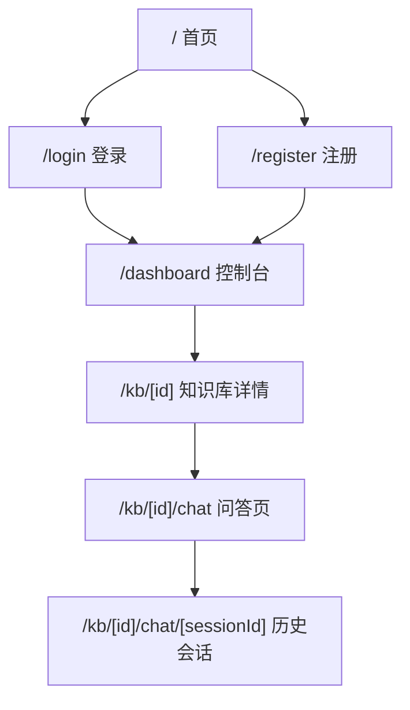
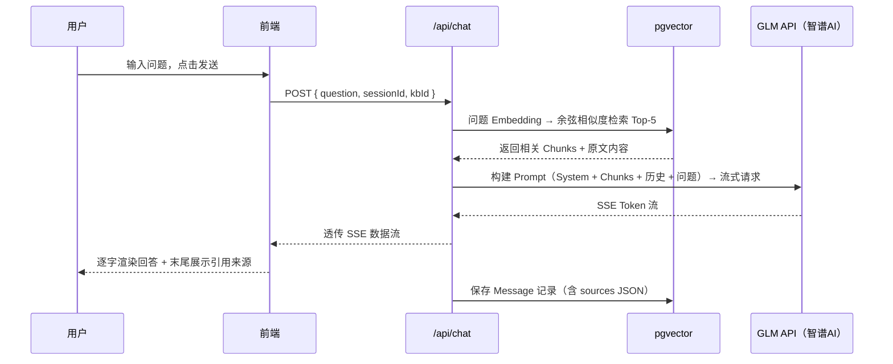
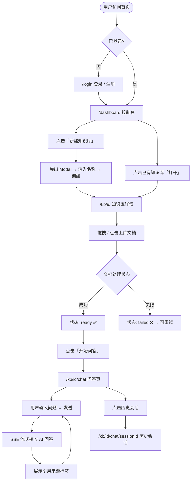

# DocMind — 页面结构与功能分析文档

> 📋 **文档版本：v2.0** | 最后更新：2026-04-30  
> 🔄 **当前阶段：前端UI搭建完成，API实现中** | 升级计划见本文【第七章】

---

## 一、整体页面地图



---

## 二、路由结构

```
app/
├── page.tsx                              # 首页（Landing Page）
├── login/
│   └── page.tsx                          # 登录页
├── register/
│   └── page.tsx                          # 注册页
└── dashboard/
    ├── layout.tsx                        # 已登录布局（全局导航 + 权限守卫）
    ├── page.tsx                          # 控制台（知识库列表）
    └── kb/
        └── [id]/
            ├── page.tsx                  # 知识库详情（文档管理）
            └── chat/
                ├── page.tsx              # 问答页（新建会话）
                └── [sessionId]/
                    └── page.tsx          # 历史会话详情
```

---

## 三、页面逐一分析

---

### 3.1 首页 `/`

#### 页面布局

```
┌─────────────────────────────────────────────────────────────┐
│  🧠 DocMind                        [登录]   [免费开始使用]   │  ← Navbar
├─────────────────────────────────────────────────────────────┤
│                                                             │
│              上传文档，即刻获得精准 AI 问答                  │  ← Hero Section
│           告别信息幻觉，所有答案来自你的文档                  │
│                    (副标题说明文字)                          │
│                                                             │
│                 [  免费开始使用 →  ]                         │
│                                                             │
├─────────────────────────────────────────────────────────────┤
│                                                             │
│   ┌───────────────┐  ┌───────────────┐  ┌───────────────┐  │  ← Features
│   │  📄 多格式支持 │  │  🔍 语义检索  │  │  📌 引用溯源  │  │
│   │  PDF/MD/TXT   │  │  余弦相似度   │  │  来源可追溯   │  │
│   │  自动解析入库  │  │  Top-K 精选  │  │  杜绝幻觉     │  │
│   └───────────────┘  └───────────────┘  └───────────────┘  │
│                                                             │
├─────────────────────────────────────────────────────────────┤
│                                                             │
│   三步上手                                                   │  ← How it works
│                                                             │
│   ① 上传文档          ② 建立知识库         ③ 开始提问       │
│   上传 PDF/MD/TXT    系统自动解析向量化    获得带来源的精准回答│
│                                                             │
├─────────────────────────────────────────────────────────────┤
│  © 2025 DocMind          GitHub          Privacy Policy     │  ← Footer
└─────────────────────────────────────────────────────────────┘
```

#### 功能模块说明

| 模块 | 功能描述 | 交互行为 |
|---|---|---|
| Navbar | Logo + 导航链接 + 操作按钮 | 「登录」→ `/login`；「免费开始使用」→ 未登录跳 `/login`，已登录跳 `/dashboard` |
| Hero Section | 核心卖点标语 + CTA 按钮 | CTA 同上 |
| Features | 三大功能亮点卡片 | 静态展示，无交互 |
| How it works | 三步操作说明 | 静态展示 |
| Footer | 版权信息 + 外部链接 | 链接跳转 |

---

### 3.2 登录页 `/login`

#### 页面布局

```
┌─────────────────────────────────────────────────────────────┐
│  🧠 DocMind                                                 │
├─────────────────────────────────────────────────────────────┤
│                                                             │
│                  ┌────────────────────────┐                │
│                  │      登录你的账户       │                │
│                  │                        │                │
│                  │  [ 🐙  GitHub 登录   ] │                │
│                  │  [ G   Google 登录   ] │                │
│                  │                        │                │
│                  │  ─────────── 或 ─────  │                │
│                  │                        │                │
│                  │  邮箱  [____________]  │                │
│                  │  密码  [____________]  │                │
│                  │                        │                │
│                  │  [       登 录       ] │                │
│                  │                        │                │
│                  │  还没有账户？  注册 →   │                │
│                  └────────────────────────┘                │
│                                                             │
└─────────────────────────────────────────────────────────────┘
```

#### 功能模块说明

| 模块 | 功能描述 | 交互行为 |
|---|---|---|
| OAuth 登录 | GitHub / Google 一键授权 | 跳转 Provider → 回调写入 session → `/dashboard` |
| 邮箱登录表单 | Email + Password 输入 | 校验 → 成功跳 `/dashboard`；失败显示行内错误 |
| 注册跳转 | 底部文字链接 | → `/register` |

---

### 3.3 控制台 `/dashboard`

#### 页面布局

```
┌────────────────┬────────────────────────────────────────────────┐
│  🧠 DocMind    │                               [ + 新建知识库 ] │
│                ├────────────────────────────────────────────────┤
│  ──────────    │                                                │
│  📚 知识库     │   我的知识库  (共 2 个)                         │
│                │                                                │
│  ──────────    │  ┌──────────┐  ┌──────────┐  ┌────────────┐  │
│  👤 用户名     │  │ 技术文档  │  │ 学习笔记  │  │     +      │  │
│  [退出登录]    │  │          │  │          │  │  新建知识库 │  │
│                │  │ 3 篇文档  │  │ 7 篇文档  │  │            │  │
│                │  │ 2 天前更新│  │ 1 天前更新│  │            │  │
│                │  │          │  │          │  │            │  │
│                │  │[打开][删] │  │[打开][删] │  │            │  │
│                │  └──────────┘  └──────────┘  └────────────┘  │
│                │                                                │
│                │  ┄┄┄ 空状态提示 ┄┄┄                           │
│                │  还没有知识库，点击右上角「新建知识库」开始     │
└────────────────┴────────────────────────────────────────────────┘
     全局导航侧边栏              主内容区
```

#### 功能模块说明

| 模块 | 功能描述 | 交互行为 |
|---|---|---|
| 左侧导航 | Logo + 菜单 + 用户信息 | 「退出登录」→ 清除 session → 跳转 `/` |
| 知识库卡片 | 展示名称/文档数量/更新时间 | 「打开」→ `/kb/[id]`；「删除」→ 确认弹窗 → 删除并刷新列表 |
| 新建按钮 | 顶部右侧固定按钮 | 弹出 Modal → 输入名称 → 提交 → 卡片列表刷新 |
| 空状态 | 无知识库时引导界面 | 引导点击「新建知识库」 |

#### 状态管理

- **知识库列表**：Server Component 直接 fetch（RSC，无需客户端状态）
- **新建 / 删除**：Server Action + `revalidatePath('/dashboard')` 触发刷新

---

### 3.4 知识库详情 `/kb/[id]`

#### 页面布局

```
┌────────────────┬──────────────────────────────────────────────────┐
│  🧠 DocMind    │ ← 返回控制台    技术文档知识库     [开始问答 →]  │
│                ├──────────────────────────────────────────────────┤
│  ──────────    │                                                  │
│  📚 知识库     │  ┌──────────────────────────────────────────────┐ │
│                │  │                                              │ │
│  ──────────    │  │    📂  拖拽文件到此处，或点击选择文件         │ │
│  👤 用户名     │  │    支持 PDF / Markdown / TXT（最大 10MB）    │ │
│  [退出登录]    │  │                                              │ │
│                │  └──────────────────────────────────────────────┘ │
│                │                                                  │
│                │  文档列表                                         │
│                │  ┌──────────────────────────────────────────────┐ │
│                │  │ 文件名          大小    状态      上传时间  操作│ │
│                │  ├──────────────────────────────────────────────┤ │
│                │  │ api-doc.pdf    2.3MB  ✅ 就绪   2 天前    🗑  │ │
│                │  │ notes.md       45KB   ⏳ 处理中  1 分钟前  🗑  │ │
│                │  │ guide.txt      12KB   ❌ 失败   3 天前  🔄 🗑 │ │
│                │  └──────────────────────────────────────────────┘ │
└────────────────┴──────────────────────────────────────────────────┘
```

#### 功能模块说明

| 模块 | 功能描述 | 交互行为 |
|---|---|---|
| 上传区域 | 拖拽或点击选择文件 | 前端拦截大小/类型 → 调用 `/api/upload` → 文档状态置为 `processing` |
| 文档列表 | 展示文档信息和处理状态 | `processing` 状态时每 3s 轮询刷新 |
| 状态 Badge | `processing` / `ready` / `failed` 三态 | 视觉区分；`processing` 带 loading 动画 |
| 删除按钮 | 每行末尾 | 确认弹窗 → 删除文档及关联 chunks |
| 重试按钮 | 仅 `failed` 文档显示 | 重新触发文档解析 → 状态重置为 `processing` |
| 开始问答 | 页面顶部按钮 | → `/kb/[id]/chat` |

#### 文档状态流转

```
上传文件
  └─→ processing（前端轮询刷新）
         ├─→ ready   ✅  （可问答）
         └─→ failed  ❌  （可手动重试）
```

---

### 3.5 问答页 `/kb/[id]/chat`

#### 页面布局

```
┌────────────────┬─────────────────┬───────────────────────────────┐
│  🧠 DocMind    │                 │  技术文档知识库    [管理文档]  │
│                │  [ + 新建会话 ] ├───────────────────────────────┤
│  ──────────    │                 │                               │
│  📚 知识库     │  📝 Next.js配置 │  ┌─────────────────────────┐  │
│                │  📝 RAG 原理    │  │ 👤 Next.js如何配置重定向？ │  │
│  ──────────    │  📝 部署问题    │  └─────────────────────────┘  │
│  👤 用户名     │                 │                               │
│  [退出登录]    │  (当前高亮)      │  ┌─────────────────────────┐  │
│                │  📝 Next.js配置 │  │ 🤖 在 next.config.js 中  │  │
│                │                 │  │ 可以使用 redirects 字段   │  │
│                │                 │  │ 进行页面跳转配置...       │  │
│                │                 │  │                           │  │
│                │                 │  │ 📎 引用来源               │  │
│                │                 │  │ [api-doc.pdf · 第3段]     │  │
│                │                 │  │ [guide.txt · 第7段]       │  │
│                │                 │  └─────────────────────────┘  │
│                │                 │                               │
│                │                 │  ┌─────────────────────────┐  │
│                │                 │  │ 输入你的问题...   [发送] │  │
│                │                 │  └─────────────────────────┘  │
└────────────────┴─────────────────┴───────────────────────────────┘
    全局导航          会话侧边栏              对话主区域
```

#### 功能模块说明

| 模块 | 功能描述 | 交互行为 |
|---|---|---|
| 会话列表侧边栏 | 展示历史会话标题列表 | 点击会话 → 加载对应历史消息；当前会话高亮 |
| 新建会话按钮 | 会话列表顶部 | 创建新会话记录 → 清空对话区 → 新会话高亮 |
| 消息气泡 | 用户消息（右对齐）/ AI 消息（左对齐） | — |
| 流式输出 | AI 回答逐字出现 | SSE 连接 → ReadableStream → 逐 chunk append |
| 引用来源标签 | AI 消息底部 | 点击标签 → 展开对应原文 snippet |
| 输入框 | 底部固定，多行支持 | Enter 发送；Shift+Enter 换行；发送中禁用输入 |
| 发送状态 | 发送/生成中显示 loading | 流式结束后恢复可输入状态 |

#### 问答数据流



---

### 3.6 历史会话 `/kb/[id]/chat/[sessionId]`

#### 布局与问答页相同，差异如下

| 差异点 | 问答页（新会话） | 历史会话页 |
|---|---|---|
| 消息内容 | 空，等待用户提问 | 加载完整历史 messages |
| 当前高亮会话 | 新建会话 | 对应 sessionId 的会话 |
| 输入框行为 | 正常可输入发送 | 仍可继续追问（同一会话继续） |

---

## 四、用户核心操作流程



---

## 五、组件树（关键页面）

### 问答页组件树

```
ChatPage
├── GlobalNav                          # 全局左侧导航
│   ├── Logo
│   ├── NavLinks
│   └── UserInfo + LogoutButton
│
├── KBHeader                           # 顶部知识库标题栏
│   ├── KBTitle
│   └── ManageDocsLink
│
├── SessionSidebar                     # 会话列表侧边栏
│   ├── NewSessionButton
│   └── SessionList
│       └── SessionItem × N            # 点击切换 / 高亮当前
│
└── ChatArea                           # 主对话区域
    ├── MessageList
    │   ├── UserMessage × N
    │   └── AIMessage × N
    │       ├── MessageContent          # Markdown 渲染
    │       ├── StreamingCursor         # 流式时显示光标
    │       └── SourceTagList
    │           └── SourceTag × N       # 点击展开原文 snippet
    │
    └── ChatInput
        ├── Textarea                    # 支持多行，Enter 发送
        └── SendButton                  # 发送中显示 loading
```

### 知识库详情页组件树

```
KBDetailPage
├── GlobalNav
│
├── KBDetailHeader
│   ├── BackButton                     # ← 返回控制台
│   ├── KBTitle
│   └── StartChatButton                # 开始问答 →
│
├── UploadZone                         # 拖拽上传区域
│   ├── DropArea                       # 拖拽触发区
│   └── FileInput                      # 点击触发 input[type=file]
│
└── DocumentTable
    ├── TableHeader
    └── DocumentRow × N
        ├── FileNameCell
        ├── FileSizeCell
        ├── StatusBadge                 # processing / ready / failed
        ├── UploadTimeCell
        ├── RetryButton                 # 仅 failed 显示
        └── DeleteButton
```

---

## 六、关键交互细节

### 文档状态轮询逻辑

```
进入 /kb/[id] 页面
  → 检查文档列表中是否有 processing 状态
  → 若有 → 启动轮询 setInterval(3000)
        → GET /api/kb/[id]/documents
        → 更新文档列表状态
        → 若全部变为 ready / failed → clearInterval 停止
  → 若无 processing → 不启动轮询
  → 页面 unmount / 路由离开 → clearInterval 清除
```

### SSE 流式输出处理

```
用户点击发送
  → 前端追加 UserMessage 气泡
  → fetch('/api/chat', { method: 'POST', body: JSON.stringify({...}) })
  → response.body → getReader() → ReadableStream
  → TextDecoder 解析 chunk
  → 追加至 AIMessage 内容（逐字 append）
  → 流结束标志 → 渲染完整 SourceTagList
  → 解锁输入框 + SendButton
```

### 新建知识库 Modal 流程

```
点击「新建知识库」
  → 打开 Dialog（shadcn/ui Dialog）
  → 输入名称（最少 2 字符校验）
  → 点击「创建」
  → Server Action: createKnowledgeBase(formData)
  → 写入数据库
  → revalidatePath('/dashboard')
  → 关闭 Modal
  → 列表刷新，新卡片出现
```

---

## 七、实现现状与升级方向

### 当前状态（✅）

| 模块 | 完成度 | 说明 |
|------|--------|------|
| **前端UI框架** | 100% | 所有页面 HTML + CSS 搭建完成，使用 shadcn/ui 组件库 |
| **路由结构** | 100% | Next.js App Router 路由配置完成 |
| **认证系统** | 100% | NextAuth.js GitHub OAuth 集成完成 |
| **页面交互** | 80% | 基础交互完成，API 集成待实现 |
| **数据流** | 20% | 数据流架构设计完成，API 实现中 |

### 待实现的关键功能

| 功能 | 依赖的API | 优先级 |
|------|----------|--------|
| 文档上传 + 处理状态轮询 | `/api/upload`, `/api/documents/status` | P0 |
| SSE 流式问答 | `/api/chat` | P0 |
| 知识库管理 | `/api/kb` CRUD | P0 |
| 对话历史查询 | `/api/sessions/:id/messages` | P0 |
| 文档删除 / 重试 | `/api/documents/:id/delete`, `/api/documents/:id/retry` | P1 |

### 升级方向（长期规划）

#### 第二阶段：Agent 编排系统（2-3周后）

**目标：** 从单一 RAG 升级为多 Agent 系统

**前端改动：**
- 在问答页添加"Agent 执行步骤"可视化展示（可选）
- 展示每个 Agent 的执行进度和中间结果

**示例流程：**
```
用户问题
  ↓
PreprocessAgent：问题清理、意图分类、关键词提取
  ↓（结果：cleaned_question, intent, keywords）
SearchAgent：向量检索、结果重排
  ↓（结果：top_5_chunks）
GenerateAgent：Prompt 构建、流式生成
  ↓（结果：answer + sources）
ValidationAgent：答案质量评分
  ↓
返回最终结果给用户
```

#### 第三阶段：MCP 工具系统（1个月后）

**目标：** 让 Agent 能调用外部工具

**前端改动：**
- 在问答过程中展示 Agent 调用的 Tool（如 WebSearch、Calculator）
- 展示每个 Tool 的执行结果

**支持的工具示例：**
- `WebSearch` — 网络搜索工具
- `Calculator` — 数学计算工具
- `CodeExecutor` — 代码执行工具
- `APICall` — API 调用工具

---

*文档版本：v2.0 | 最后更新：2026-04-30*
